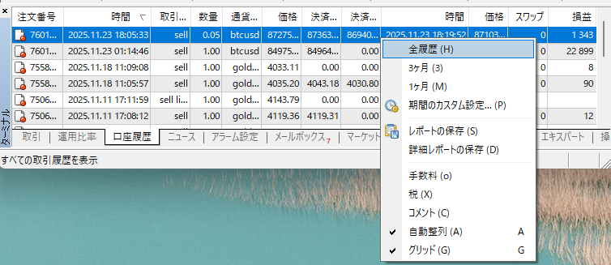

# MT4 の口座履歴をエクスポートしてアプリにアップロードする手順

このガイドでは、MetaTrader 4（MT4）の「口座履歴」から  
トレード履歴を **HTML レポートとしてエクスポート** し、  
本アプリ（trade_analytics）にアップロードする方法を説明します。

---

## 📌 1. MT4 の「口座履歴」タブを開く

MT4 の下部パネルから **「口座履歴」** タブをクリックします。

（例）  


---

## 📌 2. 表示期間を設定する

口座履歴のどこでも右クリックするとメニューが表示されます。

そこから **表示期間を選択** できます：

- 全履歴  
- 3ヶ月  
- 1ヶ月  
- カスタム設定  

（例）  


分析したい期間を選択してください。

---

## 📌 3. HTML レポートとして保存する（エクスポート）

右クリック → **「レポートの保存」** または **「詳細レポートの保存」** をクリックします。

- 標準の「レポートの保存」で HTML 形式のレポートが保存されます  
- 「詳細レポートの保存」を選ぶと、より多くの項目を含む HTML が保存されます  
- アプリでは **HTML のままアップロード可能** です  
  （内部で自動的に解析されます）

> ※ MT4 には純粋な CSV 出力機能がないため、**HTML レポートをアップロードしてください。**

---

## 📌 4. アプリにアップロードする

1. `http://localhost:3000/`（またはデプロイ先 URL）へアクセス  
2. メニューの **「データアップロード」** をクリック  
3. 「ファイル選択」ボタンで、MT4 から保存した HTML ファイルを選択  
4. **「アップロード」ボタン** を押す  

アプリが自動的に：

- 通貨ペア  
- 売買方向  
- ロット  
- 約定価格  
- 損益  
- 日時  

などを解析し、内部 DB に取り込みます。

---

## 📌 5. 分析画面で結果を確認する

アップロード後、メニューの：

- **「分析」 → 「通貨ごとの勝率」**  
- **「損益チャート」**  
- **「日別サマリー」**

などから結果を確認できます。

---

## 📁 画像ファイルの配置

このガイドで使用している画像ファイルは、次のように配置します。

```text
docs/
  ├─ upload_guide.md
  └─ images/
       ├─ mt4_history.png
       └─ mt4_period.png
